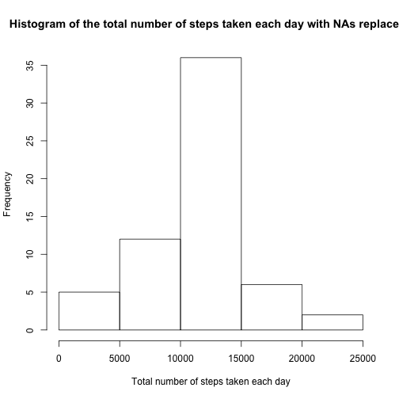

## Loading and preprocessing the data

```r
library(lubridate)
library(dplyr)
am_data <- read.table("./activity.csv", header = TRUE, sep=",", na.strings="NA", stringsAsFactors=FALSE)
```


## What is mean total number of steps taken per day?

#### Total number of steps taken per day, ignore the missing values in the dataset.

```r
by_day <- group_by(am_data, date)
total_steps_by_day <- summarise(by_day, total_steps=sum(steps, na.rm=TRUE))
total_steps_by_day_df <- data.frame(total_steps_by_day)
total_steps_by_day_df
```

```
##          date total_steps
## 1  2012-10-01           0
## 2  2012-10-02         126
## 3  2012-10-03       11352
## 4  2012-10-04       12116
## 5  2012-10-05       13294
## 6  2012-10-06       15420
## 7  2012-10-07       11015
## 8  2012-10-08           0
## 9  2012-10-09       12811
## 10 2012-10-10        9900
## 11 2012-10-11       10304
## 12 2012-10-12       17382
## 13 2012-10-13       12426
## 14 2012-10-14       15098
## 15 2012-10-15       10139
## 16 2012-10-16       15084
## 17 2012-10-17       13452
## 18 2012-10-18       10056
## 19 2012-10-19       11829
## 20 2012-10-20       10395
## 21 2012-10-21        8821
## 22 2012-10-22       13460
## 23 2012-10-23        8918
## 24 2012-10-24        8355
## 25 2012-10-25        2492
## 26 2012-10-26        6778
## 27 2012-10-27       10119
## 28 2012-10-28       11458
## 29 2012-10-29        5018
## 30 2012-10-30        9819
## 31 2012-10-31       15414
## 32 2012-11-01           0
## 33 2012-11-02       10600
## 34 2012-11-03       10571
## 35 2012-11-04           0
## 36 2012-11-05       10439
## 37 2012-11-06        8334
## 38 2012-11-07       12883
## 39 2012-11-08        3219
## 40 2012-11-09           0
## 41 2012-11-10           0
## 42 2012-11-11       12608
## 43 2012-11-12       10765
## 44 2012-11-13        7336
## 45 2012-11-14           0
## 46 2012-11-15          41
## 47 2012-11-16        5441
## 48 2012-11-17       14339
## 49 2012-11-18       15110
## 50 2012-11-19        8841
## 51 2012-11-20        4472
## 52 2012-11-21       12787
## 53 2012-11-22       20427
## 54 2012-11-23       21194
## 55 2012-11-24       14478
## 56 2012-11-25       11834
## 57 2012-11-26       11162
## 58 2012-11-27       13646
## 59 2012-11-28       10183
## 60 2012-11-29        7047
## 61 2012-11-30           0
```

#### Histogram of the total number of steps taken each day, ignore the missing values in the dataset.

```r
hist(total_steps_by_day_df$total_steps, xlab="Total number of steps taken each day",
     main="Histogram of the total number of steps taken each day ignoring NAs")
```

 

#### Mean and median of the total number of steps taken per day, ignore the missing values in the dataset and <u>rows with 0 step</u>.

```r
filtered_am_data <- filter(am_data, steps!=0)
by_day <- group_by(filtered_am_data, date)
mean_median_steps_by_day <- summarise(by_day, 
                                      mean_steps=mean(steps, na.rm=TRUE),
                                      median_steps=median(steps, na.rm=TRUE))
mean_median_steps_by_day_df <- data.frame(mean_median_steps_by_day)
mean_median_steps_by_day_df
```

```
##          date mean_steps median_steps
## 1  2012-10-02   63.00000         63.0
## 2  2012-10-03  140.14815         61.0
## 3  2012-10-04  121.16000         56.5
## 4  2012-10-05  154.58140         66.0
## 5  2012-10-06  145.47170         67.0
## 6  2012-10-07  101.99074         52.5
## 7  2012-10-09  134.85263         48.0
## 8  2012-10-10   95.19231         56.5
## 9  2012-10-11  137.38667         35.0
## 10 2012-10-12  156.59459         46.0
## 11 2012-10-13  119.48077         45.5
## 12 2012-10-14  160.61702         60.5
## 13 2012-10-15  131.67532         54.0
## 14 2012-10-16  157.12500         64.0
## 15 2012-10-17  152.86364         61.5
## 16 2012-10-18  152.36364         52.5
## 17 2012-10-19  127.19355         74.0
## 18 2012-10-20  125.24096         49.0
## 19 2012-10-21   96.93407         48.0
## 20 2012-10-22  154.71264         52.0
## 21 2012-10-23  101.34091         56.0
## 22 2012-10-24  104.43750         51.5
## 23 2012-10-25   56.63636         35.0
## 24 2012-10-26   77.02273         36.5
## 25 2012-10-27  134.92000         72.0
## 26 2012-10-28  110.17308         61.0
## 27 2012-10-29   80.93548         54.5
## 28 2012-10-30  110.32584         40.0
## 29 2012-10-31  179.23256         83.5
## 30 2012-11-02  143.24324         55.5
## 31 2012-11-03  117.45556         59.0
## 32 2012-11-05  141.06757         66.0
## 33 2012-11-06  100.40964         52.0
## 34 2012-11-07  135.61053         58.0
## 35 2012-11-08   61.90385         42.5
## 36 2012-11-11  132.71579         55.0
## 37 2012-11-12  156.01449         42.0
## 38 2012-11-13   90.56790         57.0
## 39 2012-11-15   20.50000         20.5
## 40 2012-11-16   89.19672         43.0
## 41 2012-11-17  183.83333         65.5
## 42 2012-11-18  162.47312         80.0
## 43 2012-11-19  117.88000         34.0
## 44 2012-11-20   95.14894         58.0
## 45 2012-11-21  188.04412         55.0
## 46 2012-11-22  177.62609         65.0
## 47 2012-11-23  252.30952        113.0
## 48 2012-11-24  176.56098         65.5
## 49 2012-11-25  140.88095         84.0
## 50 2012-11-26  128.29885         53.0
## 51 2012-11-27  158.67442         57.0
## 52 2012-11-28  212.14583         70.0
## 53 2012-11-29  110.10938         44.5
```


## What is the average daily activity pattern?

#### Time series plot (i.e. type = "l") of the 5-minute interval (x-axis) and the average number of steps taken, averaged across all days (y-axis), ignore the missing values in the dataset.

```r
by_interval <- group_by(am_data, interval)
mean_steps_by_interval <- summarise(by_interval, 
                                    mean_steps=mean(steps, na.rm=TRUE))
mean_steps_by_interval_df <- data.frame(mean_steps_by_interval)
mean_steps_by_interval_df$simulated_seq <- seq(0, 1435, by=5)
oct1 <- ymd("2012-10-01")
oct2 <- ymd("2012-10-02")
seq_interval <- seq(oct1, oct2, by = "5 min")
mean_steps_by_interval_df$seq_interval <- seq_interval[1:288]
with(mean_steps_by_interval_df, plot(seq_interval, mean_steps, type="l", 
                                     xlab="Time of Day (HH:MM)",
                                     ylab="Number of Steps (Mean)",
                                     main="Average daily activity pattern"))
```

 

#### The 5-minute interval, on average across all the days in the dataset, which contains the maximum number of steps

```r
max_interval <- mean_steps_by_interval_df %>% filter(mean_steps == max(mean_steps))
max_interval
```

```
##   interval mean_steps simulated_seq        seq_interval
## 1      835   206.1698           515 2012-10-01 08:35:00
```


## Imputing missing values

#### Calculate and report the total number of missing values in the dataset (i.e. the total number of rows with NAs)

```r
summary(am_data)
```

```
##      steps            date              interval     
##  Min.   :  0.00   Length:17568       Min.   :   0.0  
##  1st Qu.:  0.00   Class :character   1st Qu.: 588.8  
##  Median :  0.00   Mode  :character   Median :1177.5  
##  Mean   : 37.38                      Mean   :1177.5  
##  3rd Qu.: 12.00                      3rd Qu.:1766.2  
##  Max.   :806.00                      Max.   :2355.0  
##  NA's   :2304
```
Total number of rows with NAs is 2304 as seen in the above summary.

#### Create a new dataset that is equal to the original dataset but with the missing data filled in, using the mean for that 5-minute interval. 
The strategy is to merge the am_data dataset with the mean_steps_by_interval_df dataset using inner join on the interval key and iterate through the merged dataset replacing missing data with the mean for that 5-minute interval

```r
merged_data <- merge(am_data, mean_steps_by_interval_df, by="interval")
replace <- function(steps, mean_steps) {
  if(is.na(steps)) {
    fill <- mean_steps 
  } else {
    fill <- steps
  }
  fill
}
filled <- mapply(replace, merged_data$steps, merged_data$mean_steps)
filled_merged_data <- cbind(merged_data, filled)
select_filled_merged_data <- select(filled_merged_data, interval, filled, date)
select_filled_merged_data_by_day <- group_by(select_filled_merged_data, date)
filled_total_steps_by_day <- summarise(select_filled_merged_data_by_day, total_steps=sum(filled, na.rm=TRUE))
filled_total_steps_by_day_df <- data.frame(filled_total_steps_by_day)
hist(filled_total_steps_by_day_df$total_steps, xlab="Total number of steps taken each day",
     main="Histogram of the total number of steps taken each day with NAs replaceed")
```

 

#### Mean and median of the total number of steps taken per day, replacing the missing values in the dataset with the mean for that 5-minute interval and <u>ignoring rows with 0 step</u>.

```r
filtered_filled_merged_data <- filter(filled_merged_data, filled!=0)
filtered_filled_merged_data_by_day <- group_by(filtered_filled_merged_data, date)
filtered_filled_mean_median_steps_by_day <- summarise(filtered_filled_merged_data_by_day,
                                                      mean_steps=mean(filled, na.rm=TRUE),
                                                      median_steps=median(filled, na.rm=TRUE))
filtered_filled_mean_median_steps_by_day_df <- data.frame(filtered_filled_mean_median_steps_by_day)
filtered_filled_mean_median_steps_by_day_df
```

```
##          date mean_steps median_steps
## 1  2012-10-01   40.02301     37.45283
## 2  2012-10-02   63.00000     63.00000
## 3  2012-10-03  140.14815     61.00000
## 4  2012-10-04  121.16000     56.50000
## 5  2012-10-05  154.58140     66.00000
## 6  2012-10-06  145.47170     67.00000
## 7  2012-10-07  101.99074     52.50000
## 8  2012-10-08   40.02301     37.45283
## 9  2012-10-09  134.85263     48.00000
## 10 2012-10-10   95.19231     56.50000
## 11 2012-10-11  137.38667     35.00000
## 12 2012-10-12  156.59459     46.00000
## 13 2012-10-13  119.48077     45.50000
## 14 2012-10-14  160.61702     60.50000
## 15 2012-10-15  131.67532     54.00000
## 16 2012-10-16  157.12500     64.00000
## 17 2012-10-17  152.86364     61.50000
## 18 2012-10-18  152.36364     52.50000
## 19 2012-10-19  127.19355     74.00000
## 20 2012-10-20  125.24096     49.00000
## 21 2012-10-21   96.93407     48.00000
## 22 2012-10-22  154.71264     52.00000
## 23 2012-10-23  101.34091     56.00000
## 24 2012-10-24  104.43750     51.50000
## 25 2012-10-25   56.63636     35.00000
## 26 2012-10-26   77.02273     36.50000
## 27 2012-10-27  134.92000     72.00000
## 28 2012-10-28  110.17308     61.00000
## 29 2012-10-29   80.93548     54.50000
## 30 2012-10-30  110.32584     40.00000
## 31 2012-10-31  179.23256     83.50000
## 32 2012-11-01   40.02301     37.45283
## 33 2012-11-02  143.24324     55.50000
## 34 2012-11-03  117.45556     59.00000
## 35 2012-11-04   40.02301     37.45283
## 36 2012-11-05  141.06757     66.00000
## 37 2012-11-06  100.40964     52.00000
## 38 2012-11-07  135.61053     58.00000
## 39 2012-11-08   61.90385     42.50000
## 40 2012-11-09   40.02301     37.45283
## 41 2012-11-10   40.02301     37.45283
## 42 2012-11-11  132.71579     55.00000
## 43 2012-11-12  156.01449     42.00000
## 44 2012-11-13   90.56790     57.00000
## 45 2012-11-14   40.02301     37.45283
## 46 2012-11-15   20.50000     20.50000
## 47 2012-11-16   89.19672     43.00000
## 48 2012-11-17  183.83333     65.50000
## 49 2012-11-18  162.47312     80.00000
## 50 2012-11-19  117.88000     34.00000
## 51 2012-11-20   95.14894     58.00000
## 52 2012-11-21  188.04412     55.00000
## 53 2012-11-22  177.62609     65.00000
## 54 2012-11-23  252.30952    113.00000
## 55 2012-11-24  176.56098     65.50000
## 56 2012-11-25  140.88095     84.00000
## 57 2012-11-26  128.29885     53.00000
## 58 2012-11-27  158.67442     57.00000
## 59 2012-11-28  212.14583     70.00000
## 60 2012-11-29  110.10938     44.50000
## 61 2012-11-30   40.02301     37.45283
```


## Are there differences in activity patterns between weekdays and weekends?

#### Create a new factor variable in the dataset with two levels -- "weekday" and "weekend" indicating whether a given date is a weekday or weekend day.

```r
select_filled_merged_data$date <- as.Date(select_filled_merged_data$date, "%Y-%m-%d")
isWeekend <- weekdays(select_filled_merged_data$date) %in% c('Saturday', 'Sunday')
weekday.f <- factor(isWeekend, labels=c("weekday", "weekend"))
select_filled_merged_data <- cbind(select_filled_merged_data, isWeekend)
select_filled_merged_data <- cbind(select_filled_merged_data, weekday.f)
```

#### panel plot containing a time series plot (i.e. type = "l") of the 5-minute interval (x-axis) and the average number of steps taken, averaged across all weekday days or weekend days (y-axis).

```r
by_weekdayF_interval <- group_by(select_filled_merged_data, weekday.f, interval)
filled_mean_steps_by_interval <- summarise(by_weekdayF_interval,
                                           mean_steps=mean(filled, na.rm=TRUE))
filled_mean_steps_by_interval_df <- data.frame(filled_mean_steps_by_interval)
oct1 <- ymd("2012-10-01")
oct2 <- ymd("2012-10-02")
seq_interval <- seq(oct1, oct2, by = "5 min")
weekday <- seq_interval[1:288]
weekend <- seq_interval[1:288]
seq_interval <- combine(weekday, weekend)
filled_mean_steps_by_interval_df <- cbind(filled_mean_steps_by_interval_df, seq_interval)
library(lattice)
time_series <- seq(oct1, oct2, by="5 hours")
xyplot(mean_steps ~ seq_interval | weekday.f, data = filled_mean_steps_by_interval_df, layout = c(1, 2), type = "l",
       scales=list(x=list(at=time_series, labels=format(time_series, "%H:%M"))), 
       xlab="Time of Day (HH:MM)",
       ylab="Number of Steps (Mean)",
       main="Steps taken per 5-minute interval")
```

 
